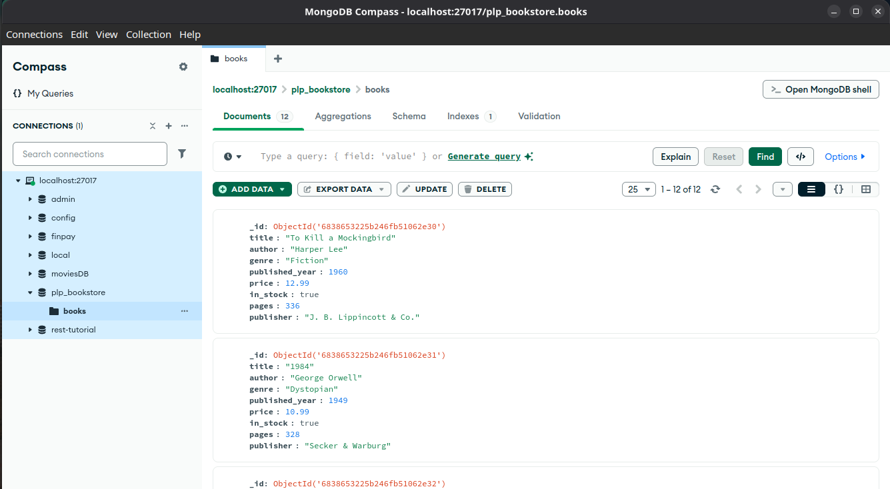

# 📚 MongoDB Bookstore Queries

This project contains a sample MongoDB database named `plp_bookstore` populated with book data and includes a series of queries demonstrating basic CRUD operations, advanced filtering, aggregation pipelines, and indexing for performance optimization.

---



## 🧰 Prerequisites

-   MongoDB installed locally or access to a MongoDB Atlas cluster
-   Mongo Shell (`mongosh`) or a MongoDB GUI (e.g., Compass, Studio 3T)
-   Node.js (only needed to run the data insertion script)

---

## 🚀 Getting Started

1. **Clone the repository or copy the script files.**
2. **Insert Sample Data**

    Run the following command in your terminal to insert the books into your MongoDB database:

    ```bash
    node insert_books.js
    ```

## Access MongoDB Shell

Start your MongoDB shell:

```bash
mongosh
```

## Switch to the database

```bash
use plp_bookstore
```
